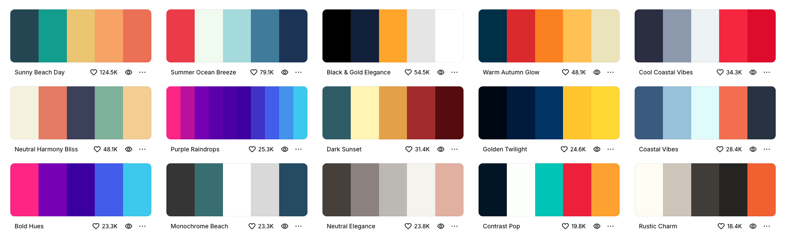
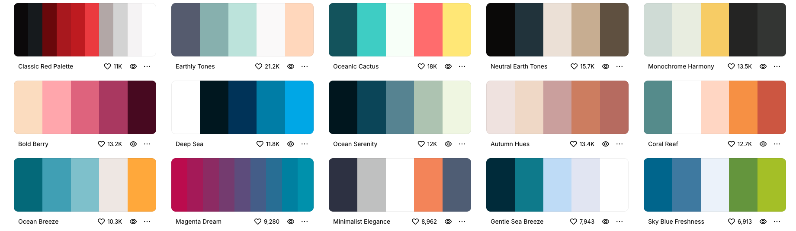
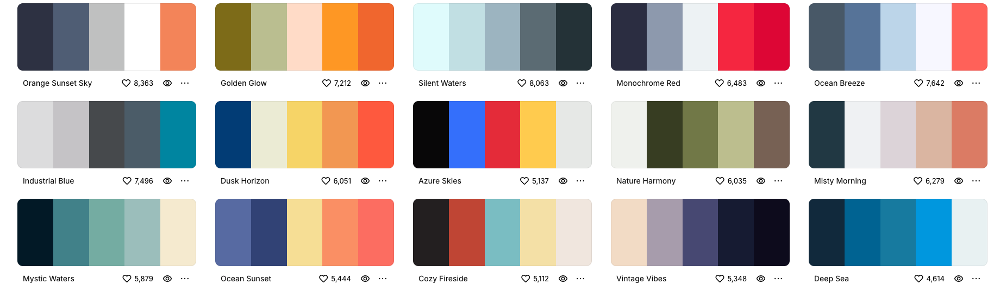
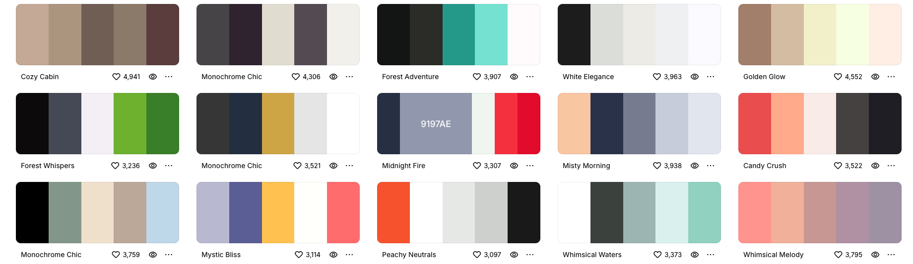
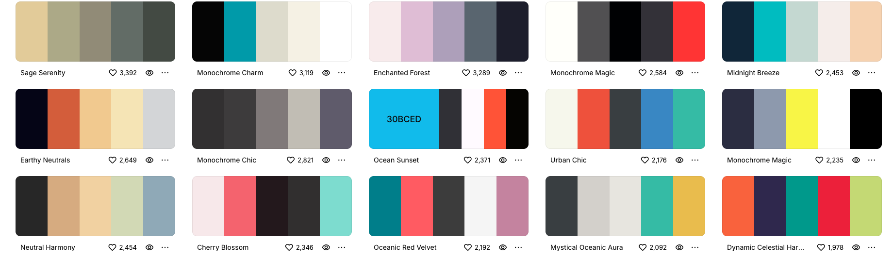

# This skills use to make a UI with modern color pallets and google font icons.

Skills are stored in the skills folder.

To use the skills, you can use this commands to copy the skill to the .claude/skills folder.

1. Copy the skill to the .claude/skills folder.
2. Enable the skill in the Claude settings.
3. Use the skill in your prompts.

To update the skills:

1. Copy the updated skill to the .claude/skills folder.
2. Reload Claude.

To remove the skills:

1. Delete the skill from the .claude/skills folder.
2. Reload Claude.

### Included color pallets

## Install from GitHub repository

### Install the entire repository
npx skills add ThanojP377/agent-skill-ui-icons-and-color-pallets

### Install a specific subfolder skill
npx skills add https://github.com/ThanojP377/agent-skill-ui-icons-and-color-pallets/tree/main/skills/use-google-font-icons